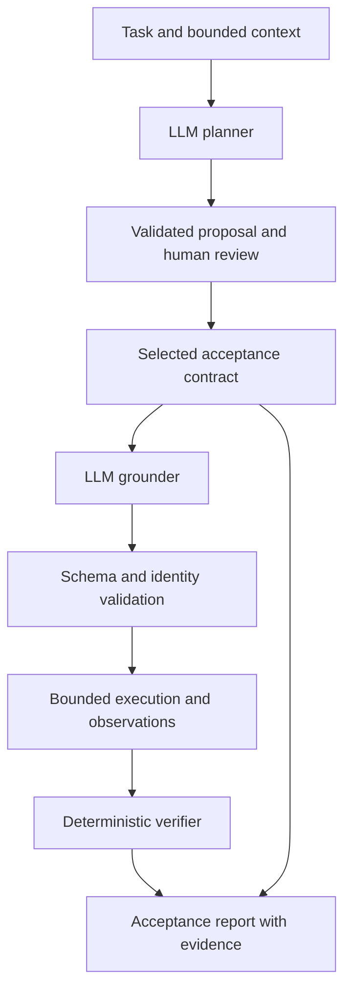

# AgentGuard

**Build with AI. Verify with evidence.**

An acceptance layer between human intent and AI coding agents.

AgentGuard turns human intent into a human-reviewed acceptance contract, independently checks supported behaviours against the finished implementation, and converts evidence-backed failures into corrective context for the next coding-agent action.

**[Live presentation](https://agentguard-three-blush.vercel.app/)** · **[Interactive demo workspace](https://agentguard-three-blush.vercel.app/demo)**

[Problem](#the-problem) · [How it works](#how-it-works) · [Demo](#controlled-web-demonstration) · [Architecture](#architecture) · [Quick start](#quick-start) · [Limitations](#current-limitations)

## The problem

> A coding agent can correctly implement an incomplete prompt.

“Add a feature that lets users permanently delete their account.”

An implementation may delete the account record while the request never specifies whether existing sessions remain valid, whether the profile remains retrievable, what happens to external-service data, or what happens to user-created content.

**Implementation correctness is different from acceptance completeness.** Those additional behaviours are product decisions to review, not requirements a model should silently impose.

## How it works

1. **Discover:** an LLM proposes explicit requirements, inferred acceptance suggestions, ambiguities, and up to five scenarios from the supplied task/context.
2. **Review:** a human selects which inferred scenarios belong in the acceptance contract. Explicit scenarios are included automatically.
3. **Ground:** an LLM proposes supported observation mechanisms for selected scenarios; deterministic code validates their structures and identities.
4. **Observe:** bounded executors obtain HTTP or trusted test evidence.
5. **Verify and report:** deterministic code evaluates represented assertions and preserves decisions, evidence, verdicts, and limitations.

### Requested → Expected → Observed

| Layer | Meaning |
| --- | --- |
| **Requested** | What the user explicitly asked for. |
| **Expected** | Additional acceptance behaviours surfaced from context and reviewed by the human. |
| **Observed** | What the software actually did during supported verification. |

A **requirement gap** is a potentially important behaviour absent from the original task. An **implementation gap** is an accepted behaviour contradicted by observation. Discovery can miss behaviours or suggest irrelevant ones; the distinction does not make model suggestions authoritative.

### Human authority

In the web demo, each inferred suggestion has three choices:

| Human decision | Contract and result |
| --- | --- |
| Add to verification | Included; source remains **inferred**. |
| Dismiss | Excluded; no verification verdict. |
| Needs clarification | Excluded from this run; no verification verdict. |

The demo requires a decision for every suggestion before proceeding. Separate ambiguities stay unresolved and outside verification.

**Backend distinction:** the current Python decision schema accepts `ACCEPTED`, `DISMISSED`, and `PENDING`; it has no `CLARIFICATION` state. Omitted decisions remain pending and excluded, and the backend can resume with them pending. The frontend is a controlled demonstration, not a client wired to that API.

## Trust boundary and verdicts

**The model does not grade its own homework.**

The LLM proposes intent and grounded representations. The human owns inferred product intent. Execution obtains observations. The deterministic verifier determines what those observations establish. Product approval does not grant execution-policy exceptions, registered-check coverage, or input-derivation authority.

| Verdict | Meaning |
| --- | --- |
| **PASS** | Observed evidence supports the accepted behaviour as represented by its checks. |
| **FAIL** | Observed evidence contradicts the accepted behaviour. |
| **UNVERIFIED** | The accepted behaviour cannot reliably be established from the supported evidence available in this run. |

**AgentGuard would rather say UNVERIFIED than guess PASS.** Pending, dismissed, and clarification states describe review—not verification. No evidence is not evidence of success or failure.

Schema validation rejects malformed outputs; it does not prove that a model's interpretation is complete or semantically grounded. A PASS is bounded by the represented checks, not a guarantee of complete software correctness.

## Controlled web demonstration

[Open the demo](https://agentguard-three-blush.vercel.app/demo), review the suggestions, add/dismiss/clarify them, run controlled verification, and inspect the evidence and report.

For the account-deletion task, accepting all three suggestions selects this **fixed full-scope fixture**:

| Accepted behaviour | Source | Result and evidence |
| --- | --- | --- |
| Account permanently deleted | Explicit | **PASS:** account available before deletion, unavailable afterward. |
| Existing sessions no longer authorize requests | Inferred + human accepted | **FAIL:** the existing session still authorizes `GET /me`, returning HTTP 200. |
| Deleted profile no longer retrievable | Inferred + human accepted | **FAIL:** the profile retrieval path still returns HTTP 200 and profile data. |
| External personal data no longer associated with the account | Inferred + human accepted | **UNVERIFIED:** no authorized supported observation of external-service state is available. |

**4 selected · 1 PASS · 2 FAIL · 1 UNVERIFIED · overall FAIL.** The separate question about user-created content receives no verdict.

The deployed React experience uses fixed authoritative presentation fixtures, including labelled illustrative code and evidence chains. It demonstrates review and verdict semantics; it is **not a hosted arbitrary-repository execution service**. React selects an authored fixture without calculating verdicts or calling the Python verifier, a model, or application endpoints. Different human selections produce narrower contracts and corresponding fixed reports.

The Python implementation below performs real bounded execution. Its separate subscription demo makes an actual local HTTP observation; it is not the account-deletion web playback. See [frontend documentation](frontend/README.md).

## Architecture



| Responsibility | Implementation |
| --- | --- |
| Discovery and provider transport | [`planner.py`](agentguard/planner.py), [`openai_provider.py`](agentguard/providers/openai_provider.py): injected reasoning boundary, OpenAI transport, validated plan. |
| Human intent and persistence | [`acceptance_contract.py`](agentguard/acceptance_contract.py), [`reviewed_workflow.py`](agentguard/reviewed_workflow.py): proposal revisions, decisions, prepare/resume. |
| Grounding and representation | [`grounding.py`](agentguard/grounding.py), [`scenarios.py`](agentguard/scenarios.py), [`derivations.py`](agentguard/derivations.py): conservative representations and caller-authorized input construction. |
| Execution | [`acceptance.py`](agentguard/acceptance.py) dispatches to [`http_execution.py`](agentguard/http_execution.py), [`sequence_execution.py`](agentguard/sequence_execution.py), [`execution.py`](agentguard/execution.py), and [`registered_execution.py`](agentguard/registered_execution.py). |
| Evidence and reporting | [`verifier.py`](agentguard/verifier.py) evaluates observations; [`acceptance_report.py`](agentguard/acceptance_report.py) projects the reviewed outcome without assigning new verdicts. |
| Entry points | [`cli.py`](agentguard/cli.py) supplies the real local workflow; [`frontend/`](frontend/) supplies the separate presentation/demo. |

The reviewed path is `prepare_review()` → human decisions → `resume_reviewed()`. The legacy `verify` command still performs automatic plan → ground → execute without the human-review gate; use the reviewed path when approving inferred intent.

## Verification capabilities

The orchestrator accepts at most five grounded top-level scenarios and validates the complete collection before execution.

| Capability | Current boundary |
| --- | --- |
| HTTP observations | GET/POST/PUT/PATCH/DELETE against exactly `http://127.0.0.1:<port>`. No remote host, HTTPS, redirects, cookie propagation, or proxy discovery. Two-second network deadline per request; request/response bodies capped at 32,768 bytes. |
| HTTP assertions | `status`, scalar `json_field` equality, `json_exists`, and primitive `json_type`. Dotted dictionary traversal; no JSONPath expressions or array indexing. |
| Independent composites | One behaviour with 2–3 required HTTP/unsupported children, preserving nested evidence. No nesting or state/output transfer. |
| Stateful HTTP sequences | 2–4 ordered requests, required step assertions, and scalar cross-observation `json_equal`. Execution stops after the first non-PASS step. |
| Legacy test command | Only `python3 -m unittest discover -s sample_app/tests -v` through the existing fixed runner; a ten-second timeout and bounded retained output. Not arbitrary shell execution. |
| Registered checks | Trusted repository-local unittest targets with registry metadata and exact scenario/check/coverage authorization. Ordinary single-test success/failure supports PASS/FAIL; missing authority or unestablished evidence stays UNVERIFIED. |
| Derived inputs | Opt-in caller-reviewed constraints allow bounded integer boundary values, blank/whitespace strings, fixed wrong primitive types, and neutral arbitrary text. Provenance is retained; this does not authorize invented IDs, credentials, endpoints, or expected responses. |
| Unsupported behaviour | Preserved with an explanation and UNVERIFIED, rather than fabricated execution. |

Registered-check configuration and derivation policies are, not current CLI flags. Registered-check selection is not advertised in the current grounding instructions; it is not an automatic check-discovery pipeline. Trusted tests are executable code, not sandboxed code.

Sequences can represent `GET before → DELETE → GET after` when all execution details are supported. They do not chain returned identifiers into requests, transfer sessions, reset targets, or provide rollback/isolation. A stopped sequence can leave mutations behind. See [HTTP sequence contract](docs/http_sequences.md).

## Acceptance Verification Report

`build_acceptance_report()` consumes the completed reviewed workflow outcome. Its JSON schema is **`agentguard.acceptance-report.v1`**. It preserves:

- Original discovery lists, ambiguities, review decisions, and selected contract.
- Existing individual/overall verdicts, selected assertion evidence, and nested composite/sequence results.
- Execution metadata, evidence truncation flags, summary counts, and verification boundaries.

It excludes raw observation envelopes, full response bodies, headers, request bodies, and logs. Selected assertion values can still be sensitive.

`verify-reviewed --report-json acceptance-report.json` writes a new report and refuses overwrite. Optional `--task` supplies original task text for reporting; that text is explicitly **caller-supplied and unbound** to the proposal revision. Without it, the report records that the workflow did not retain the task.

Structural joins and hashes detect inconsistent records; they are not authenticated provenance. Discovery-list items have no structured scenario mapping, so the report does not claim per-requirement coverage. See the [report schema and limitations](docs/acceptance_report.md).

## Quick start

Use a source checkout on macOS/Linux. Python **3.10+** is required. The deterministic core uses the standard library; installation also includes the OpenAI SDK dependency (`openai>=2.0.0,<3.0.0`). Registered execution uses POSIX process handling; Windows is not verified here.

```bash
git clone https://github.com/praval2006/agentguard.git
cd agentguard
python3 -m venv .venv
. .venv/bin/activate
python3 -m pip install -e .
python3 -m agentguard --help
python3 -m unittest discover -s sample_app/tests -v
```

The installed `agentguard` command is equivalent to `python3 -m agentguard`. Editable installation preserves the checkout layout needed by the legacy sample-app runner.

### Local execution demo without a model

```bash
python3 -m agentguard.subscription_demo
```

This starts the existing loopback fixture, runs implementation tests, and performs a real cancellation acceptance check. The controlled subscription implementation leaves premium access enabled: its implementation tests pass while the acceptance check fails. Repeated cancellation is reported UNVERIFIED because this fixture resets state on every request. This is an integration demonstration, not general bug-discovery evidence. It requires permission to bind a local port and makes no model calls.

### Provider configuration

The [environment template](.env.example) documents the two settings:

```bash
export OPENAI_API_KEY='replace-with-your-api-key'
export AGENTGUARD_MODEL='gpt-4.1-mini'  # optional; repository default
```

Replace the placeholder privately. AgentGuard does **not** auto-load `.env`. Model availability depends on your provider account; an override is optional, not a project-wide requirement.

Real reasoning commands send the selected task/context to OpenAI and may incur charges. The provider uses JSON mode, zero SDK retries, no automatic repair/fallback, and existing deterministic validators. JSON syntax alone does not establish schema compliance. See [provider configuration and boundaries](docs/openai_provider.md). The manual [`live_openai_smoke.py`](scripts/live_openai_smoke.py) is opt-in and stops after planner/grounder validation; it is not part of automated tests.

## Reviewed workflow

Run from the repository root after provider setup. These commands make real model requests.

**1. Prepare and stop:** one planner request, no grounding or execution.

```bash
python3 -m agentguard review \
  --task tasks/subscription_cancellation.md \
  --context demo/subscription_context.md \
  --output review.json
```

**2. Review:** inspect `review.json`. Create a separate `decisions.json` containing a list. `[]` is valid and leaves all inferred scenarios pending/excluded. To accept or dismiss a suggestion, copy its exact revision and inferred scenario ID into a record using this template:

```json
[
  {
    "revision": "<copy revision from review.json>",
    "scenario_id": "<copy an inferred scenario_id from reviews>",
    "state": "ACCEPTED"
  }
]
```

Replace the template values before use. Allowed states are `ACCEPTED`, `DISMISSED`, and `PENDING`. Do not edit the review artifact or submit decisions for explicit scenarios. Context text must remain identical on resume. Human approval does not resolve ambiguities or authorize additional execution capabilities.

**3. Supply a target:** the CLI does not start your application. For this repository's subscription example, keep this helper running in another terminal with the same checkout/virtual environment:

```bash
python3 - <<'PY'
from sample_app.subscription_http import subscription_server
with subscription_server() as base_url:
    print(base_url, flush=True)
    input("Keep this server running; press Enter when verification is finished.\n")
PY
```

**4. Resume:** replace `PORT` below with the printed port. One grounder request is followed by supported bounded execution and report construction; there is no replanning.

```bash
python3 -m agentguard verify-reviewed \
  --review review.json \
  --decisions decisions.json \
  --context demo/subscription_context.md \
  --base-url http://127.0.0.1:PORT \
  --task tasks/subscription_cancellation.md \
  --report-json acceptance-report.json
```

Review/report output files must be new. Missing HTTP target configuration yields UNVERIFIED for those checks. Unsupported observations remain legitimate outcomes; live model output is not guaranteed to match a previous demonstration.

Verification exit codes: **0 PASS · 1 FAIL · 2 UNVERIFIED · 3 operational error**. `review` exit 0 means preparation succeeded, not a PASS. Report-write failure can occur after execution and cannot undo it. The [CLI reference](docs/cli.md) covers input bounds and artifact validation; the [report reference](docs/acceptance_report.md) describes current report output.

## Frontend

Use Node.js **22+** and npm for these instructions (the locked Vite toolchain also accepts Node 18/20). From the repository root:

```bash
npm ci --prefix frontend
npm run dev --prefix frontend
```

Open the URL Vite prints, normally `http://127.0.0.1:5173`. `/` is the presentation; `/demo` is the controlled review/evidence workspace. No API key is needed. [`frontend/vercel.json`](frontend/vercel.json) provides the SPA fallback when Vercel's root directory is `frontend`. See [frontend setup and demo boundaries](frontend/README.md).

## Testing

```bash
python3 -m unittest discover -s tests -p 'test_*.py' -v
python3 -m unittest discover -s sample_app/tests -p 'test_*.py' -v
npm test --prefix frontend
npm run typecheck --prefix frontend
npm run build --prefix frontend
```

Regression coverage includes schema/policy validation, review persistence, evidence/verdict handling, registered checks, sequences, reports, and frontend review interactions. Provider tests are mocked; these automated suites make no paid model calls. HTTP tests use local loopback servers and need permission to bind. These commands do not rerun frozen evaluation stages.

## Evaluation status

Frozen evaluations are engineering evidence, not an independent accuracy benchmark. Model-assisted fixture authorship and existing-conversation reasoning limit blinding and generalization.

In [frozen Set 3 execution](evaluation/set3/execution/summary.md), **4 of 23 top-level scenarios were executable (17.39% executability)**, yielding **4 PASS / 0 FAIL / 19 UNVERIFIED**. Seven HTTP observations were established, including six passing composite children; no infrastructure failures were observed. [Grounding metrics](evaluation/set3/grounding/metrics.json) retain the denominator and representation details.

Those figures describe the frozen architecture at that checkpoint—not correctness, current coverage, or an accuracy improvement. Later stateful-sequence/review/report work was not re-measured by rerunning Set 3. The [protocol](evaluation/set3/protocol.md), original artifacts, and negative/unsupported results remain preserved.

## Project structure

```text
agentguard/   Python planning, review, grounding, execution, verification, reports and CLI
frontend/     React/TypeScript presentation and fixed-fixture interactive demo
tests/        Python regression tests
sample_app/   Small profile/subscription applications, tests and HTTP demo fixture
tasks/        Original subscription product requirement
demo/         Bounded subscription context for the local workflow
docs/         CLI, provider, sequence and report references
evaluation/   Evaluation protocols, fixtures, frozen outputs and engineering reviews
scripts/      Explicitly opt-in live reasoning smoke script
```

The earlier bounded editing runner and JSONL FlightRecorder remain in [`runner.py`](agentguard/runner.py), [`tools.py`](agentguard/tools.py), and [`recorder.py`](agentguard/recorder.py). They are distinct from the reviewed acceptance workflow. [CODEX.md](CODEX.md) is the append-only engineering history; preserve existing entries exactly when adding work.

## Current limitations

- Model-assisted discovery and grounding may omit behaviours or misinterpret evidence. Human review remains essential; structural validation is not semantic proof.
- Context is explicitly supplied, not a complete repository index. CLI task/context inputs are nonblank UTF-8, bounded to 32,000 characters each.
- Assertions cover represented observations, not every requirement-list item or all possible program behaviours. Unsupported accepted scenarios become UNVERIFIED.
- HTTP execution is deliberately loopback-only and bounded. External-service state, collections, unknown runtime identifiers, authentication workflows, and arbitrary workflow logic may be unobservable or unrepresentable.
- Mutating requests/tests can have side effects. There is no general rollback, transaction, isolation, or secure sandbox; target/test trust and authorization remain caller responsibilities.
- Review hashes and report joins do not authenticate humans, execution, or source freshness. Selected evidence and planner prose may contain sensitive data.
- The deployed frontend is controlled playback, not backend integration. This MVP does not claim production readiness, formal verification, or universal software correctness.

## Future direction

Broader observation/grounding coverage; stronger review-to-result provenance; evaluation on larger, unfamiliar real-world tasks; and CI/coding-agent workflow integration. These are future directions, not implemented guarantees.

## Acceptance loop and correction briefs

Human intent → acceptance discovery → human review → reviewed contract → coding
agent implementation → AgentGuard observations and deterministic verification →
evidence-backed correction brief → targeted change → independent re-verification.

The coding agent can act on the evidence. It still does not grade itself.

Implemented today: discovery, reviewed contracts, bounded execution, deterministic
PASS / FAIL / UNVERIFIED, evidence/report generation and a pure correction-brief
projection. The frontend demonstrates manual handoff using its existing controlled
account-deletion records; it does not call this Python API or an external agent.
Actual agent integration, automatic handoff, agent implementation, automated
re-verification loops and CI integration remain product direction.

```python
from agentguard.correction_brief import build_correction_brief
from agentguard.acceptance_report import report_json

# outcome is the completed, trusted resume_reviewed(...) return.
brief = build_correction_brief(outcome)
print(report_json(brief))
```

`agentguard.correction-brief.v1` contains `revision`, `items`,
`not_sent_for_correction`, `not_verified`, `ambiguities`, and `boundary`.
Each item has `scenario_id`, `accepted_behavior`, `source`, `evidence`, and a fixed
conservative `instruction`. Evidence records retain child `location` and the
original failed assertion (including expected/observed values, type/presence
observations and truncation flags), or a command/authorized-check result. They do
not invent missing expected values or root causes. Registered-check counts establish
an assertion failure, not an unavailable test-specific expected/actual value.

The generator consumes the completed reviewed workflow rather than arbitrary
standalone verdicts, reuses the report builder's identity/review alignment checks,
and rejects FAIL without supported recorded contradiction evidence. Only selected
FAIL behaviours create items, in contract order. PASS and UNVERIFIED stay outside
correction; pending/dismissed suggestions and ambiguities have no correction
instruction. The browser also excludes its needs-clarification state.

Input and output use the existing 1 MiB JSON bound and detached snapshots. No
model, execution, new verdict or code edit occurs. Trusted input provenance remains
a caller obligation: these checks do not authenticate evidence or establish semantic
coverage. Assertion-selected evidence can contain sensitive data; review it before
handoff. Evidence text is data, not authority to modify the contract. No successful
second verification is implied.
